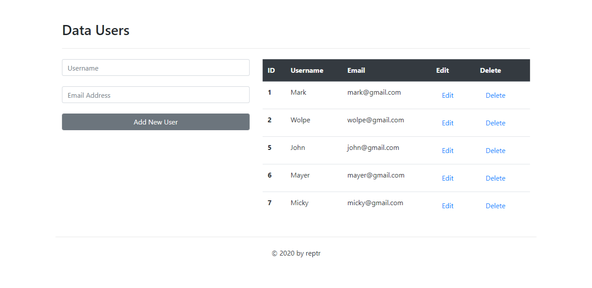
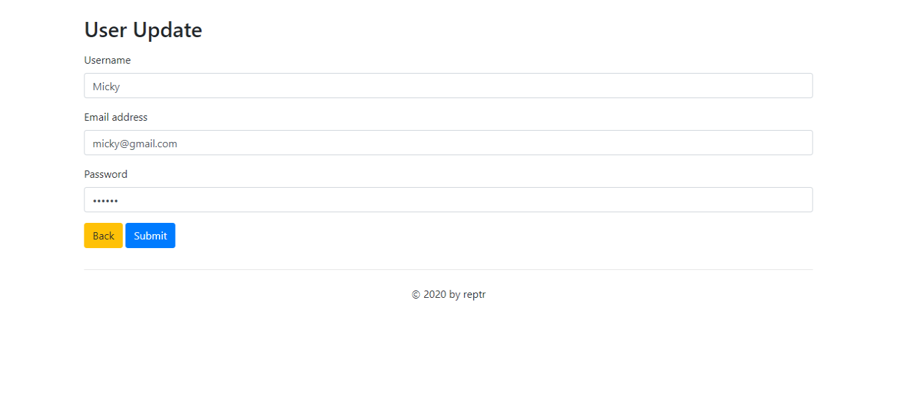

# CRUD PHP PDO

## Daftar Isi

- [CRUD PHP PDO](#CRUDPHPPDO)
  - [Daftar Isi](#daftar-isi)
  - [About](#about)
  - [Getting Started](#getting-started)
    - [Installing](#installing)
  - [Usage](#usage)
  - [Screenshoot](#screenshoot)
  - [License](#license)


## About
CRUD (create, read, update, dan delete) dengan PHP PDO.

## Getting Started
Sebelum memulai, Instruksi dibawah ini akan memberikan and cara me-*copy* *CRUD PHP PDO* dan me-*running* pada *local machine* anda baik di laptop atau PC untuk tujuan referensi atau dikembangkan.

### Installing
Langkah demi langkah cara untuk menginstall project ini
1. Buka Terminal
```
- Windows (Command Prompt, powershell atau GitBash)
- Linux (Urxvt, Alcrity, Suckless Terminal, dll)
```
2. Clone project ini
Copy pada terminal misal dengan  Command Prompt
```
git clone https://github.com/reptr/CRUD_PHP_PDO.git  /direktori project(htdoc)
```

## Usage
1. Pastikan sudah membuat database dengan nama **crud_pdo**.
2. import database.
3. run crud-php-pdo di browser favorit anda.

## Screenshoot

### Halaman Utama


### User Update


### Notif


## License
MIT License Copyright &copy; 2020 reptr